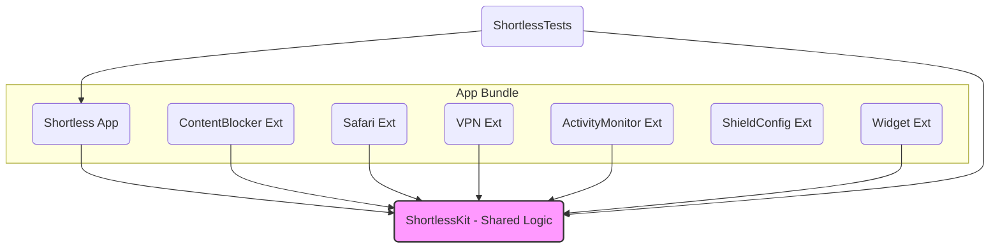

# explore results

Date: 2026-04-24
As of: 2026-04-24

## Project: shortless-ios Exploration Report

### 1. Overview

This report details the architecture, dependencies, and key patterns of the "shortless-ios" project. The project is a Swift-based iOS application that functions as a content blocker for short-form video platforms, primarily through Safari extensions and Screen Time integration. The codebase is structured as a multi-target Xcode project managed by XcodeGen.

### 2. Build System & Project Configuration

The project's structure is defined by `project.yml` and generated into an `.xcodeproj` using **XcodeGen**. This approach ensures the project configuration is version-controlled, consistent, and easily auditable.

-   **Platform:** iOS 16.0+
-   **Language:** Swift 5.9
-   **Build Tool:** XcodeGen
-   **Versioning:** `3.0.0` (Marketing), `14` (Build)

### 3. Architecture: Multi-Target & Extension-Driven

The application's functionality is highly modular, partitioned across a main application target and seven distinct App Extension targets. This is a standard and robust architecture for iOS apps that provide system-level integrations.

A local Swift Package, `ShortlessKit`, serves as a shared core for all targets, centralizing business logic, data models, and constants.

#### 3.1. Target Structure

| Target Name               | Type                  | Platform | Key Responsibilities                                                              |
| ------------------------- | --------------------- | -------- | --------------------------------------------------------------------------------- |
| `Shortless`               | Application           | iOS      | Main UI, user settings, onboarding, and container for all app extensions.         |
| `ShortlessKit`            | Swift Package (Local) | -        | Shared logic, data models (`ScheduleRule`), constants (`SettingsStore`), and utilities. |
| `ShortlessContentBlocker` | App Extension         | iOS      | Provides Safari with a `blockerList.json` to declaratively block known URLs/CSS.  |
| `ShortlessSafariExtension`| App Extension         | iOS      | Provides dynamic, script-based content blocking and communication with the main app. |
| `ShortlessVPNExtension`   | App Extension         | iOS      | Implements a packet tunnel provider for potential future network-level blocking.  |
| `ShortlessActivityMonitor`| App Extension         | iOS      | Enforces Screen Time schedules by responding to system-defined activity intervals. |
| `ShortlessShieldConfig`   | App Extension         | iOS      | Provides a custom UI (`ShieldConfigurationExtension`) for when a user tries to open a blocked app. |
| `ShortlessWidget`         | App Extension         | iOS      | Displays app statistics (e.g., block count) on the user's Home Screen.            |
| `ShortlessTests`          | Unit Test Bundle      | iOS      | Contains XCTest-based unit tests for the application and `ShortlessKit`.          |

#### 3.2. Dependency Graph

The dependency structure follows a "hub-and-spoke" model, which is a best practice for multi-target iOS projects.

-   **Hub:** `ShortlessKit` is the central hub. It has no dependencies on other targets.
-   **Spokes:** The main `Shortless` app and all seven extension targets depend on `ShortlessKit`. This prevents code duplication and ensures consistency.
-   **Container:** The `Shortless` application target embeds all functional app extensions, packaging them into the final `.ipa` bundle.



### 4. Key Architectural Patterns

#### 4.1. Inter-Process Communication via App Group & UserDefaults

The primary mechanism for sharing data between the main app and its extensions is an **App Group**. State is persisted in the shared `UserDefaults` suite associated with this group.

-   **Mechanism:** The main app writes user preferences (e.g., blocking schedule, selected apps) to the shared `UserDefaults`. The extensions read this data to configure their behavior.
-   **Data Format:** Custom `Codable` structs (e.g., `ScheduleRule`, `FamilyActivitySelection`) are encoded to `Data` using `JSONEncoder` before being stored. Extensions then decode this data.
-   **Example (`DeviceActivityMonitorExtension.swift`):**
    ```swift
    // 1. Access shared UserDefaults via the App Group ID
    let defaults = UserDefaults(suiteName: SettingsStore.appGroupID)

    // 2. Read raw Data for a given key
    guard let data = defaults?.data(forKey: SettingsStore.appBlockerSelectionKey),
          // 3. Decode the Data into a shared Codable struct from ShortlessKit
          let selection = try? JSONDecoder().decode(FamilyActivitySelection.self, from: data) else {
        return
    }

    // 4. Use the shared data to configure the extension
    store.shield.applications = selection.applicationTokens
    ```
-   **Constants:** Keys (`SettingsStore.scheduleKey`) and the App Group ID (`SettingsStore.appGroupID`) are defined centrally in `ShortlessKit` to prevent typos and ensure consistency.

#### 4.2. Screen Time Integration

The app leverages Apple's Screen Time APIs for native app blocking, a significant feature mentioned in `docs/index.html`. This involves three key components:

1.  **`FamilyControls`:** Used in the main app to allow the user to pick which applications and categories to block via `FamilyActivityPicker`. The resulting opaque `FamilyActivitySelection` tokens are saved to shared `UserDefaults`.
2.  **`DeviceActivity`:** The main app defines and starts a `DeviceActivitySchedule`. The system then wakes the `ShortlessActivityMonitor` extension at the start and end of that schedule.
3.  **`ManagedSettings`:** The `ShortlessActivityMonitor` extension uses the `ManagedSettingsStore` to apply or remove "shields" (blocks) on the applications and categories chosen by the user. The `ShortlessShieldConfig` extension provides the custom UI for these shields.

### 5. Dependencies

-   **Internal:** The project relies heavily on its internal `ShortlessKit` package. There are no other internal library dependencies.
-   **External:** The `project.yml` file **does not list any external third-party dependencies** (e.g., via Swift Package Manager, CocoaPods). The project relies solely on Apple's platform frameworks.

### 6. Summary & Recommendations

The "shortless-ios" project exhibits a clean, modern, and robust architecture well-suited for its purpose.

**Findings:**

-   **Modular Design:** The use of multiple, single-purpose app extensions is a strong architectural choice that isolates functionality.
-   **Centralized Logic:** `ShortlessKit` effectively serves as the "single source of truth" for shared business logic and data models, which is a critical pattern for maintainability.
-   **Declarative Configuration:** Using XcodeGen (`project.yml`) makes the project setup transparent and easy to manage.
-   **Standard Communication Patterns:** The use of App Group `UserDefaults` with `Codable` data is a standard, reliable, and well-understood pattern for data sharing between an app and its extensions.

**Recommendations:**

1.  **Document Shared Schema:** Consider adding formal documentation within `ShortlessKit` (e.g., in a `README.md` or header comments) that explicitly defines the schema for the shared `UserDefaults`. This should include keys, the `Codable` type stored for each key, and a description of its purpose. This will be invaluable for future maintenance.
2.  **Formalize `SettingsStore`:** Ensure the `SettingsStore` class or enum in `ShortlessKit` is the *only* place where `UserDefaults` keys are defined and accessed, enforcing a strict contract for inter-process communication.
3.  **Error Handling for Decoding:** The provided code snippet `try? JSONDecoder()...` silently fails on a decoding error. For critical paths, consider logging decoding failures from extensions to a shared log file (also in the App Group container) to aid in debugging.
